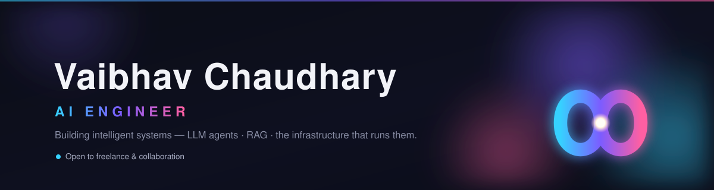

<!--
  GitHub PROFILE README for @livelong99
  → Publish: create a public repo named exactly "livelong99", add this file as README.md
    AND upload header.svg alongside it (the banner below references ./header.svg).
  → Search "EDIT" to fill the placeholders. Everything else works out of the box.
-->

 

 

<!-- EDIT: replace each # with your real URL; delete any you don't use -->

&nbsp;

---

## 🧠 About

<!-- EDIT the four lines below -->
- 🔭 Building **[Eona&nbsp;OS](https://github.com/livelong99/eona-os)** — a self-hosted, local-first multi-agent orchestration platform (Claude-powered, Obsidian-vault memory).
- 🌱 Exploring — <!-- EDIT: e.g. agentic workflows, fine-tuning, retrieval, evals -->
- 💬 Ask me about — LLM agents, RAG, prompt engineering, MLOps.
- ⚡ Fun fact — <!-- EDIT -->

## 🛠️ Tech

<!-- EDIT: trim/add to match your real stack -->
**Languages**
&nbsp;

**AI / ML**
&nbsp;

**Backend & Infra**
&nbsp;

**Frontend**
&nbsp;

## 📌 Featured projects

<!-- EDIT: add a 2nd/3rd repo — duplicate the block above and change repo=YOUR-REPO

-->

> 💡 Also pin these under **Profile → Customize your pins**.

## 📊 GitHub

&nbsp;

---

🤝 Open to freelance &amp; collaboration &nbsp;·&nbsp; 📫 <a href="mailto:va11251999@gmail.com">va11251999@gmail.com</a>

